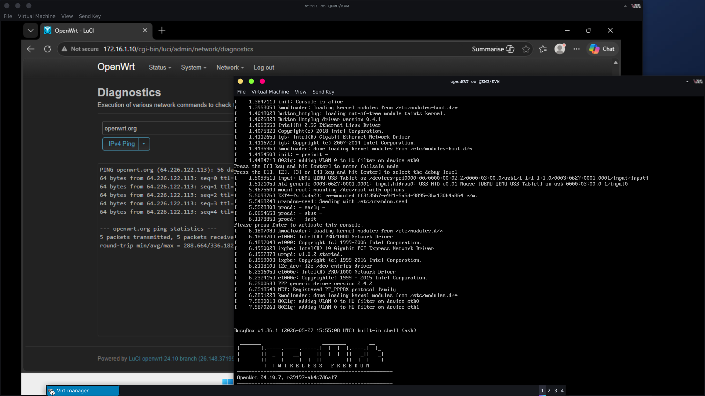

This setup is intended for testing only. No plan to increase the interfaces so no bridge was setup.

2 interfaces are set as follows:

- eth0 = LAN (isolated network, no DHCP and no direct access to the internet)
- eth1 = WAN (setup to the default NAT network, has access to the internet)

&nbsp;       

## UCI (Unified Configuration Interface)

Using uci command via console to setup the interfaces.

1\. Remove current configuration of WAN and LAN.

```bash
# View current config
uci show network

# Basic cleanup (remove old interfaces configuration)
uci delete network.wan
uci delete network.wan6
uci delete network.lan
```

&nbsp;

2\. Setup LAN on isolated network. 

```bash
uci set network.lan=interface
uci set network.lan.device='eth0'  # Or using 'br-lan', 'eth0' is for simpler setups
uci set network.lan.proto='static'
uci set network.lan.ipaddr='x.x.x.x'  # Your chosen LAN gateway
uci set network.lan.netmask='x.x.x.x'
uci set network.lan.ip6assign='60'  # Optional IPv6
```

&nbsp;

3\. Setup WAN on NAT network.

```bash
uci set network.wan=interface
uci set network.wan.device='eth1'  # Use the NAT MAC interface
uci set network.wan.proto='dhcp'

# Optional: WAN6
uci set network.wan6=interface
uci set network.wan6.device='eth1'
uci set network.wan6.proto='dhcpv6'

```

Commit changes and restart the network

```bash
uci commit network

/etc/init.d/network restart
```

4\. Test if you can update your packages

```bash
opkg update
```

5\. Test if you can access the static IP of the LAN interface using another virtual machine on the same network.



&nbsp;
