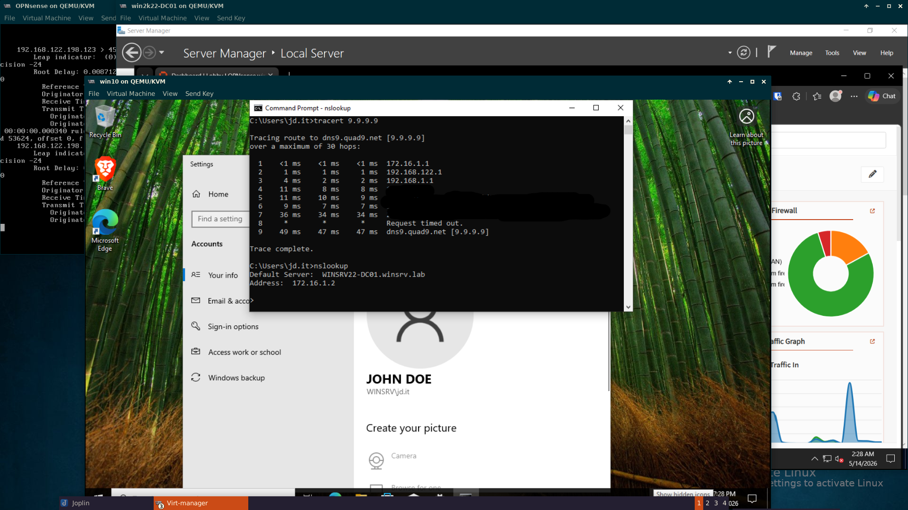

## Type 2 hypervisor: Virt-Manager KVM/QEMU

Screenshot of my current homelab which shows how tracert traversed through firewall interfaces correctly before it goes to the router at 192.168.1.1/24 and how nslookup shows my server IP and Fully Qualified Domain Name (FQDN).

&nbsp;

### Virtual Networks 

- Isolated Network
    - Network: 172.16.0.0/24
    - DHCP range: Disabled
    - Forwarding: Isolated network
- NAT Network
    - Network: 192.168.122.0/24
    - DHCP range: 192.168.122.2-192.168.122.254/24
    - Forwarding: NAT

&nbsp;

### Virtual Machines

- **Firewall**: OPNsense version 26.1  
    - LAN IP: Static 172.16.1.1/24 
    - WAN IP: DHCP leased from Virt-Manager NAT Network
    - Web GUI: http://172.16.1.1
    - DHCP on LAN: Disabled
    - DNS: Unbound - Forward to Domain Controller (in this case, the Windows Server)
        - DNS server: 172.16.1.2 added in pool
        - Domain: winsrv.lab
        - Enable DHCP Registration and DHCP Static Mappings
        - Firewall Rules (to be configured - default still)

- **Server**: Windows Server 2022 Data Center version
    - IP: Static 172.16.1.2/24
    - DHCP installed (IP range: 172.16.1.100 - 172.16.1.254/24)
    - DNS installed
    - Default gateway: 172.16.1.1/24
    - Active Director Domain Server (AD DS)  
        - Domain: winsrv.lab
        - Promoted as Domain Controller

- **Client**: Windows 10
    - IP:  Leased from Windows Server 2022
    - Domain joined

&nbsp;
