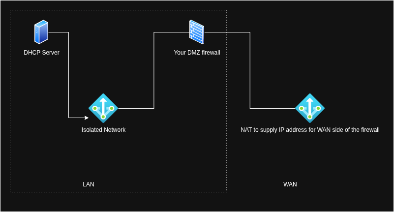

### Sample Virtual Networks XML config on Virt-Manager

&nbsp;

**Isolated network:** This network cannot connect to the internet.

- IP Address: 172.16.0.1/24
- Virtual network is assigned a unique, RFC 4122-compliant UUID upon creation.
    - Or can be generated here: https://www.uuidgenerator.net/version4
- Mac address is randomly generated, usually starts in this format 52:54:00:XX:XX:XX, upon creation.
- Domain name can be your network name or FQDN if you have a managed network.

&nbsp;

```XML
<network>
  <name>Network_Name_here</name>
  <uuid>Your_UUID_here</uuid>
  <bridge name="virbr2" stp="on" delay="0"/>
  <mac address="52:54:00:XX:XX:XX"/>
  <domain name="Network_Name_here_or_FQDN"/>
  <ip address="172.16.0.1" netmask="255.255.255.0">
  </ip>
</network>
```

&nbsp;

**Default NAT:** This network can connect to the internet through NAT

- This network has it's own DHCP capability to supply IP addresses outside the managed network and firewall
- IP Address: 192.168.122.1/24
- The DHCP IP range is: 192.168.122.2-254/24

&nbsp;

```XML
<network>
  <name>default</name>
  <uuid>Your_UUID_here</uuid>
  <forward mode="nat">
    <nat>
      <port start="1024" end="65535"/>
    </nat>
  </forward>
  <bridge name="virbr0" stp="on" delay="0"/>
  <mac address="52:54:00:XX:XX:XX"/>
  <ip address="192.168.122.1" netmask="255.255.255.0">
    <dhcp>
      <range start="192.168.122.2" end="192.168.122.254"/>
    </dhcp>
  </ip>
</network>

```

&nbsp;

**How these networks look like inside your homelab**

